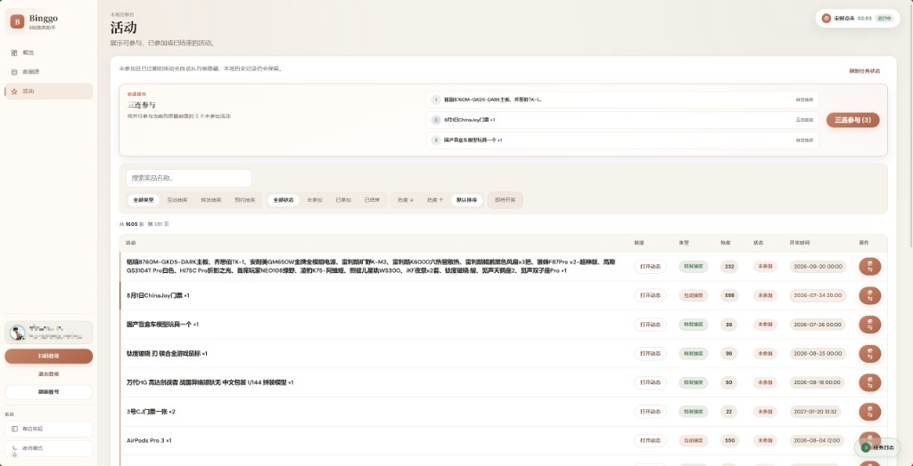
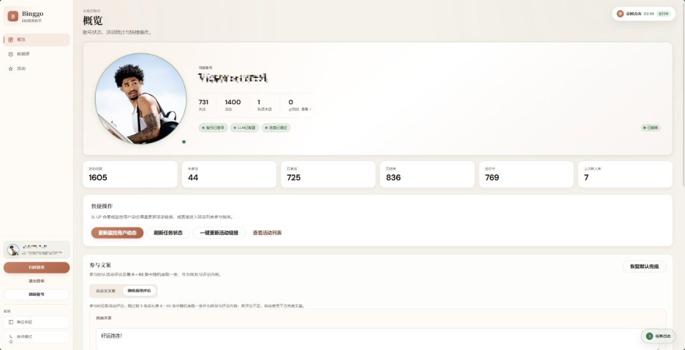

# Binggo · B 站抽奖助手

**不用一个个找活动，也不用一个个点参加。**

本机运行的 B 站抽奖管理工具：自动从 UP 合集与监控用户动态发现活动，在网页控制台一键 / 三连参与，可选定时调度。Cookie 与数据只保存在你的电脑上，控制台仅监听 `127.0.0.1`。

[](https://github.com/luovicter-collab/bilibinggo/releases/latest)
[](https://github.com/luovicter-collab/bilibinggo/actions/workflows/ci.yml)
[](https://github.com/luovicter-collab/bilibinggo/stargazers)
[](LICENSE)
[](https://www.python.org/)

🌐 **[官方网站](https://luovicter-collab.github.io/bilibinggo/)** — 界面预览、上手说明与防诈提示

---

## 下载

👉 **[最新 Release（推荐）](https://github.com/luovicter-collab/bilibinggo/releases/latest)** · **[官方网站](https://luovicter-collab.github.io/bilibinggo/)**

| 平台 | 文件 | 说明 |
|------|------|------|
| Windows | `Binggo-Setup-win64.exe` | 安装包（推荐） |
| Windows | `Binggo-Portable-win64.zip` | 便携版 |
| macOS | `Binggo-macOS-arm64.dmg` | Apple Silicon（拖到「应用程序」） |
| macOS | `Binggo-macOS-arm64.zip` | 便携 zip |

安装包启动后打开 **http://127.0.0.1:8181**；源码开发见下方 [开发](#开发)。

<p align="center">
  
</p>

---

## 为什么用它

| | |
|---|---|
| **自动发现** | 多个 UP 合集 + 监控用户转发，不用自己到处翻 |
| **一键参加** | 互动 / 转发 / 预约；「三连参与」一次清多条未参加 |
| **可定时** | 控制台内调度器，按时间表自动更新与参与 |
| **数据本机** | 登录态、活动库、参与记录不出电脑 |

---

## 五分钟上手

新安装后活动列表为空是正常的，按下面三步即可开始：

| 步骤 | 在哪里 | 做什么 |
|------|--------|--------|
| 1 | 侧栏底部 | **扫码登录**（哔哩哔哩 App） |
| 2 | 数据源 → UP 合集 | 对需要的合集点 **「更新此源」**（日常优先单源；少用「一键更新」） |
| 3 | 活动 | 筛选「未参加」→ 单条 **参与**，或顶部 **「三连参与」** |

**玩转发抽奖？** 在概览 → **LLM 配置** 填 API Key 与模型，测试通过后保存（互动 / 预约不需要）。

**想补漏？** 在数据源添加常转发抽奖的用户 MID，点 **「更新监控用户动态」**。

运行中看右下角 **任务日志**；更细的页面说明见 [控制台指南](docs/console.md)。

<p align="center">
  
</p>

---

## 功能一览

| 能力 | 说明 |
|------|------|
| 双通道发现 | UP 合集增量同步 + 监控用户转发动态 |
| 一键参与 | 互动 / 转发 / 预约；充电抽奖自动跳过 |
| 三连参与 | 按当前筛选自动选取最多 3 个未参加活动 |
| 定时点击 | 内置调度器；撞车即停，不取消正在跑的抽奖任务 |
| 参与文案 | 自定义，或随机借用评论区文案 |
| 状态追踪 | 未参加 / 已参加 / 已结束；临近开奖筛选 |
| @ 提醒 | 登录后显示 @ 未读，增长时横幅提醒 |
| 检查更新 | 概览手动检查 GitHub Releases |
| 跨平台 | Windows Setup / Portable + macOS Apple Silicon |

---

## 谨防「你已中奖」类诈骗

在 B 站及相关平台，常见有人**伪装成官方或「内部人员」**，私信声称你已在某场抽奖中中奖，进而诱导你完成任务、填写个人信息、预付邮费/保证金，或向指定账户转账。这类行为属于诈骗，与正常 UP 主发起的抽奖流程无关。

请牢记：**真中奖一般以活动页规则、UP 主公开说明或 B 站站内通知为准**，不会轻易通过私信让你先交钱、先扫码加群、或把验证码交给陌生人。凡是要求你先付款、先转账、先「解冻账户」的，都应直接拒绝并拉黑举报。

**与 Binggo 的关系：** Binggo 是本地开源工具，不会以任何名义私信你「通知中奖」，也不会代收费用、代领奖品或索要支付密码。若有人冒用 Binggo、本仓库或作者名义行骗，**与项目无关**，请提高警惕并向平台举报，必要时保留证据向公安机关报案。

完整说明见宣传站 [「注意」一节](https://luovicter-collab.github.io/bilibinggo/#notice)。

---

## 常见问题

**Cookie 会上传吗？**  
不会。凭证保存在本机 `config/cookies.txt`，控制台只绑定 `127.0.0.1`。

**为什么活动列表是空的？**  
v5 起发行版不内置活动种子。扫码登录后，在数据源对 UP 合集点 **「更新此源」** 即可拉取。

**一定要配 LLM 吗？**  
只有 **转发抽奖** 需要（解析奖品与开奖时间）。互动 / 预约可直接参与。

**Windows SmartScreen / macOS 打不开？**  
见下方 [安装说明](#安装说明)（未做商业签名 / Apple 公证时的处理方式）。

**能保证中奖吗？**  
不能。Binggo 是抽奖辅助工具，帮你省去找活动和重复点击的时间。

---

## 安装说明

> **Windows：** 未做商业签名；若 SmartScreen 拦截，选择「仍要运行」。  
> **macOS：** 未做 Apple 公证；首次请右键 → 打开。Intel Mac 请用下方源码方式运行。

| 运行方式 | 控制台地址 |
|----------|------------|
| 安装包 / 便携版 | http://127.0.0.1:8181 |
| 源码开发 | http://127.0.0.1:8787 |

---

## 数据与隐私

| 模式 | 数据根目录 |
|------|------------|
| 源码开发 | 仓库根目录 |
| Windows 安装包 | `%APPDATA%\Binggo` |
| Windows 便携（`BINGGO_PORTABLE=1`） | `Binggo.exe` 同目录 |
| macOS 默认 | `~/Library/Application Support/Binggo` |
| macOS 便携（`BINGGO_PORTABLE=1`） | `.app` 所在解压目录 |
| 自定义 | `BINGGO_HOME` |

常见文件：`data/binggo.db`、`data/logs/binggo.log`、`config/cookies.txt`、`config/llm.env`、`config/sources.yaml`。

卸载程序或删除 `.app` **不会**自动删除数据目录。凭证已在 `.gitignore` 中，请勿提交。

---

## 开发

### 从源码运行

需要 **Python 3.12+** 与 **Node.js 20+**（构建前端）。

```bash
git clone https://github.com/luovicter-collab/bilibinggo.git
cd bilibinggo
pip install -r requirements.txt
cd web/frontend && npm ci && npm run build && cd ../..
python scripts/run_dashboard.py   # http://127.0.0.1:8787
```

### 测试

```bash
# 后端
pip install -r requirements-dev.txt
python -m pytest tests/ -q

# 前端
cd web/frontend
npm ci && npm test && npm run build

# E2E（隔离数据目录，端口 8791）
npx playwright install chromium
npm run test:e2e
```

### 技术栈与扩展

| 能力 | 说明 |
|------|------|
| 本地 SQLite | 活动、参与、检查点与任务 |
| 实时进度 | SSE 推送；断线回退轮询 |
| 结构化日志 | JSONL + 概览「导出诊断包」（脱敏） |
| MCP / Skill | 可选本地扩展，见 [mcp/README.md](mcp/README.md)（不打入安装包） |

| 文档 | 说明 |
|------|------|
| [docs/console.md](docs/console.md) | 控制台逐页说明 |
| [docs/fullstack-roadmap.md](docs/fullstack-roadmap.md) | 全栈方向总览 |
| [docs/cli.md](docs/cli.md) | CLI 手册 |
| [packaging/windows/README.md](packaging/windows/README.md) | Windows 打包 |
| [packaging/macos/README.md](packaging/macos/README.md) | macOS 打包与 Gatekeeper |
| [web/frontend/README.md](web/frontend/README.md) | 前端开发 |

本地调试用种子导出（**不随发行版分发**）：

```bash
python scripts/export_activities_seed.py
python scripts/export_state_seed.py
```

旧 JSON 活动库迁入 SQLite：`python scripts/import_json_to_db.py`

---

## 更新记录

### v5.0.3（2026-07-26）

- DS-7 大锦鲤活动参与支持
- 预约抽奖增加关注步骤
- LLM「测试连接」修复
- 宣传站上线（[luovicter-collab.github.io/bilibinggo](https://luovicter-collab.github.io/bilibinggo/)）

### v5.0.2（2026-07-22）

- 修复 Windows / macOS 安装包启动失败：定时调度器不再依赖系统 `tzdata` 解析 `Asia/Shanghai`

### v5.0.1（2026-07-21）

- 修复转发抽奖开奖时间：按北京日历串解析 `lottery_time`
- 发行包仍**不**内置活动库 / 数据源 state 种子（新安装需自行「更新此源」）
- 可选本地 MCP / Skill 随源码提供，不打入安装包

### v5.0.0（2026-07-20）

- **Breaking：** 发行版不再内置活动库与 state 种子；首次活动列表为空属正常
- 全栈能力合集：SQLite、任务模型、SSE、检查更新、Win + macOS 安装包

更早版本见 [Releases](https://github.com/luovicter-collab/bilibinggo/releases)。

---

## Star History

<!-- star-history:start -->
<picture>
  <source media="(prefers-color-scheme: dark)" srcset="assets/star-history/star-history-dark.svg">
  
</picture>
<!-- star-history:end -->

---

## License

MIT
