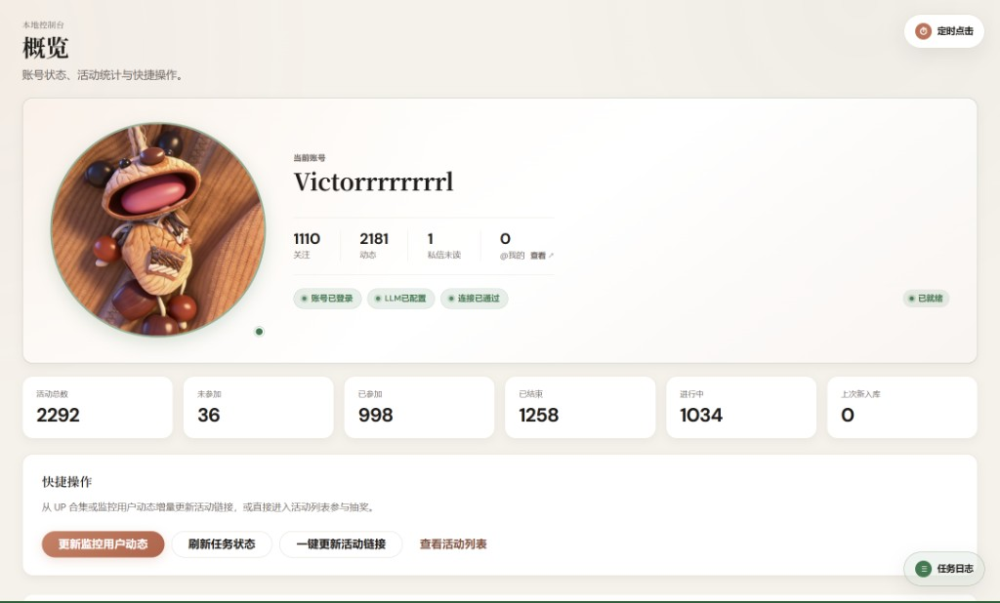
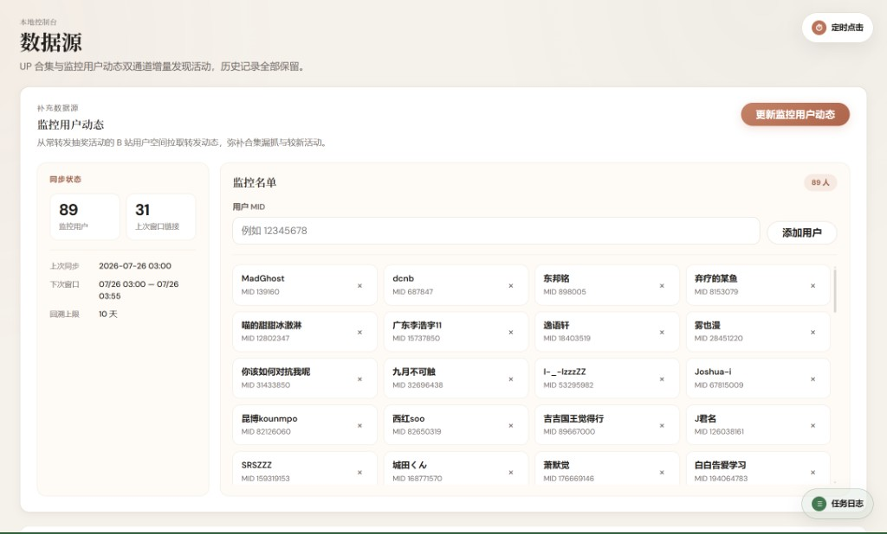
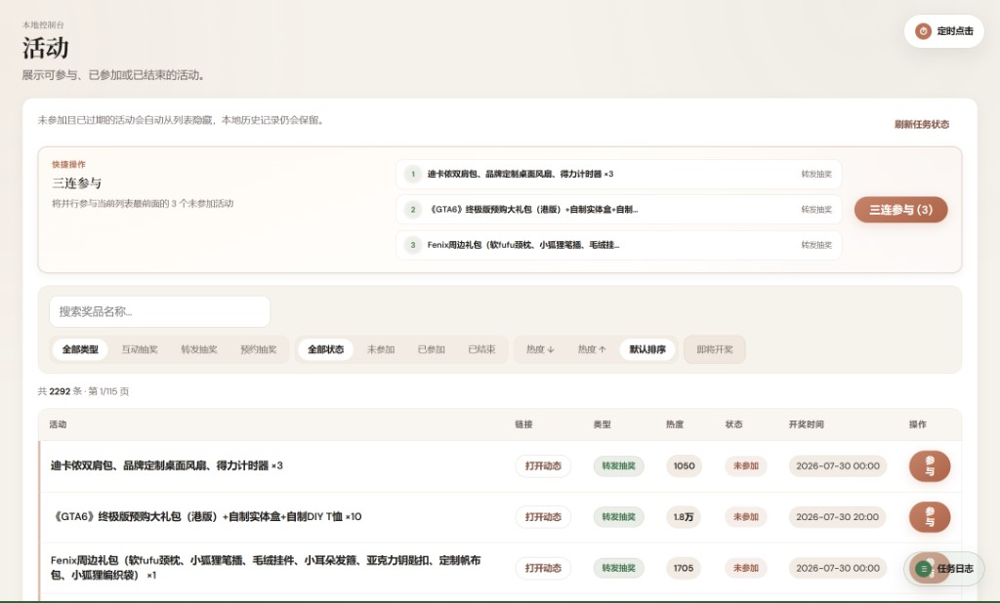
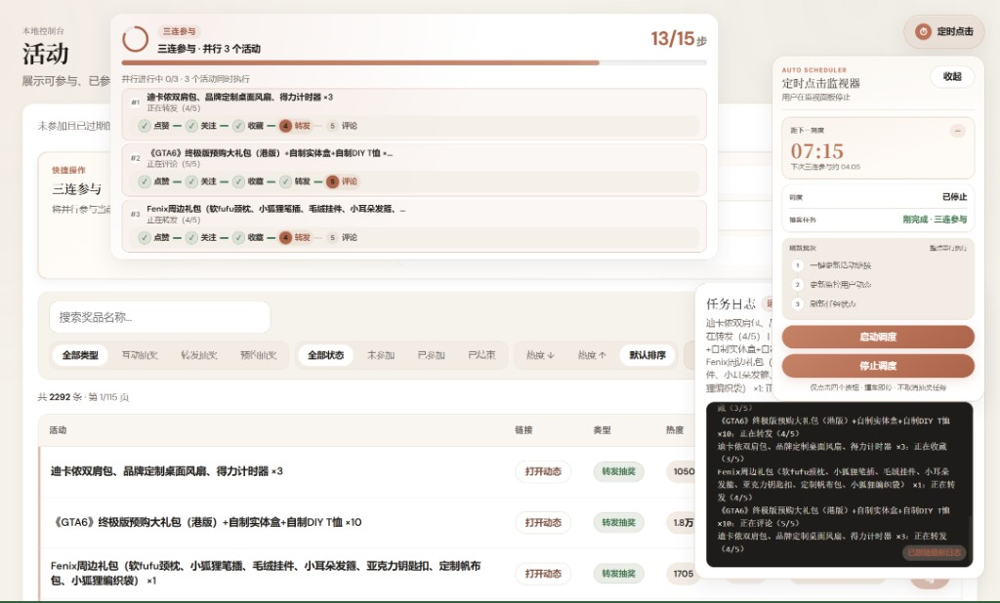
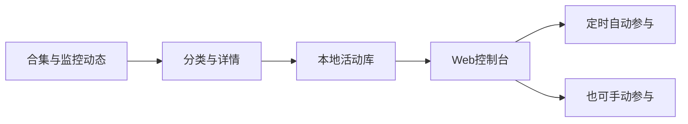

<p align="center">
  
</p>

<h1 align="center">不用一个个找，也不用一个个点</h1>

<p align="center">
  开源本机 B 站抽奖助手 · 自动发现活动，定时自动参与 · Win / macOS<br>
  <em>Local-first Bilibili lottery helper — auto-discover, schedule auto-join on your machine</em>
</p>

<p align="center">
  <a href="https://github.com/luovicter-collab/bilibinggo/releases/latest"></a>
  <a href="https://github.com/luovicter-collab/bilibinggo/actions/workflows/ci.yml"></a>
  <a href="https://github.com/luovicter-collab/bilibinggo/stargazers"></a>
  <a href="LICENSE"></a>
</p>

<p align="center">
  <a href="https://github.com/luovicter-collab/bilibinggo/releases/latest"><b>下载</b></a>
  &nbsp;·&nbsp;
  <a href="https://luovicter-collab.github.io/bilibinggo/"><b>官网</b></a>
  &nbsp;·&nbsp;
  <a href="docs/console.md"><b>文档</b></a>
  &nbsp;·&nbsp;
  <a href="https://github.com/luovicter-collab/bilibinggo/issues"><b>反馈</b></a>
</p>

## 免责声明

> **本项目仅供个人学习与研究使用**（**非官方工具**，未获哔哩哔哩授权或认可）。
>
> 使用本工具须遵守法律法规及 B 站平台规则。**严禁**将本项目或基于本项目衍生的工具用于：
>
> - **商业用途**（含收费代抽、营销引流、商业化运营等）
> - **批量操作多账号**（一机多号、养号、控号、矩阵运营等）
> - **黑产或任何违法违规活动**
>
> 由使用本工具产生的一切后果（包括但不限于 **账号封禁、功能限制、数据丢失、法律追责**）均由使用者自行承担。**项目作者及贡献者不承担任何法律责任。**

<p align="center">
  
</p>

抽奖不用自己翻合集、翻动态去找，也不用守着屏幕一条条点。Binggo 在本机 Web 控制台里 **自动发现** 活动，用 **定时点击（自动参与）** 到点帮你点更新、筛选与参与；偶尔想亲手点时，仍可单条参与或三连批量。

| | |
|---|---|
| **自动参与** · Scheduled auto-join | 定时点击监视器到点执行控制台操作；撞车即停，不必盯屏 |
| **自动找活动** · Auto-discover | 合集增量同步 + 监控名单补转发漏网 |
| **数据只在本机** · Local-only | Cookie、活动库与参与记录不上云 |

## 目录

- [免责声明](#免责声明)
- [一眼看懂](#一眼看懂)
- [为什么用 Binggo](#为什么用-binggo)
- [功能详解](#功能详解)
- [界面导览](#界面导览)
- [Star History](#star-history)
- [和手动刷 / 脚本比](#和手动刷--脚本比)
- [工作方式](#工作方式)
- [下载与上手](#下载与上手)
- [本机隐私](#本机隐私)
- [常见问题](#常见问题)
- [MCP · 用 Cursor 操作本机控制台](#mcp--用-cursor-操作本机控制台)
- [文档与开发](#文档与开发)

## 一眼看懂

以下为真实控制台界面中的示例数据，你的活动库规模取决于更新频率与监控名单。

| 维度 | 说明 |
|------|------|
| **产品形态** | 本机 Web 控制台（`127.0.0.1`），侧栏切换概览 / 数据源 / 活动 |
| **活动库** | 本地 SQLite 汇总多源链接；列表示例可达数千条，分页浏览 |
| **核心卖点** | **定时自动参与**：启动调度后，到点自动点更新 / 参与等按钮 |
| **手动补刀** | 单条「参与」；「三连参与」仅为并行最多 3 条的快捷批量 |
| **发现通道** | 内置多路 UP 合集 + 可配置监控用户 MID 转发动态 |
| **端口** | 安装包默认 **8181**；源码运行 **8787** |
| **端口** | 安装包默认 **8181**；源码运行 **8787** |

## 为什么用 Binggo

**自动参与（主能力）** — 打开「定时点击」监视器并启动调度后，Binggo 会在设定时间自动点控制台里的按钮（例如更新源、参与未参加活动）。把「发现 → 更新列表 → 参与」挂成一条线，开奖前或日常固定时段不用你一直盯着屏幕等倒计时。

**自动找活动** — 从多路 UP 合集增量同步，监控名单按时间窗口拉转发动态，把进行中的抽奖先收进活动库，省掉自己翻合集、刷动态的时间。

**本机可控** — 控制台只监听 `127.0.0.1`；调度与 Job **撞车即停**，不会无脑并发硬抢。需要时仍可手动单条参与，或用三连一次处理少量未参加（非核心，只是省事快捷键）。

### 更多能力

- **定时调度** — 到点自动点击；与进行中的任务撞车时自动停机
- **发现** — 多路 UP 合集增量同步，监控名单补全转发动态
- **参与** — 互动 / 转发 / 预约（关注 + 预约）；充电抽奖自动跳过
- **三连参与** — 可选：当前筛选下并行最多 3 条未参加（手动触发的一次批量）
- **跨平台** — Windows 安装包与便携版；macOS Apple Silicon（dmg / zip）
- **转发解析** — 概览配置 LLM 并测试通过后，可解析转发抽奖正文（奖品、开奖时间）；互动 / 预约不耗 LLM
- **参与文案** — 自定义转发/评论内容，或随机借用动态评论（不足时用兜底文案）
- **夜间模式** — 亮/暗主题本地记忆

## 功能详解

### 概览

- **上手引导** — 首次可引导登录、LLM、更新源、参与；可跳过
- **账号卡片** — 登录态、关注/动态/未读等；状态如「账号已登录」「LLM 已配置」「连接通过」
- **统计卡片** — 活动总数、未参加 / 已参加 / 已结束、进行中等汇总
- **快捷操作** — 更新监控用户动态、刷新任务状态、一键更新活动链接、跳转活动列表
- **参与文案** — 配置评论/转发用语；支持随机借用评论
- **LLM 配置** — 解析转发抽奖正文；推荐兼容 OpenAI 接口的模型（如 DeepSeek），需先测试通过
- **项目信息** — 版本、数据目录、检查更新、导出诊断包（脱敏，不含 Cookie / API Key）

日常请用数据源页的 **「更新此源」**；概览「一键更新」会串行扫多个合集，请求更猛，易触发风控。

### 数据源

两条发现通道，历史记录本地保留。

- **UP 合集** — 内置多个抽奖合集源；流程为检查新专栏 → 分类 → 拉详情 → 入库（只处理新增链接）
- **「更新此源」** — 只更新当前合集，**推荐日常使用**
- **「一键更新」** — 更新全部合集，适合空库首次灌库，平时慎用
- **监控用户动态** — 填入用户 **MID** 加入名单；按窗口拉转发动态，补合集未收录的活动
- **同步信息** — 展示监控人数、上次同步、下次窗口与回溯上限（默认约 10 天）

### 活动

| 功能 | 说明 |
|------|------|
| 类型筛选 | 互动抽奖 / 转发抽奖 / 预约抽奖 |
| 状态筛选 | 未参加 / 已参加 / 已结束 |
| 热度排序 | 按热度升/降序，或默认排序 |
| 即将开奖 | 收窄临近开奖的活动 |
| 单条参与 | 对当前行执行完整参与流程 |
| 三连参与 | 并行参与列表最前面最多 3 条未参加 |
| 刷新任务状态 | 回查开奖/参与结果（不拉新链接） |

未参加且已过期的活动会从列表隐藏，本地库仍保留历史。

### 活动类型（参与动作）

| 类型 | 典型动作 | 说明 |
|------|----------|------|
| **互动抽奖** | 关注 + 转发 + 评论等 | 官方互动组件，一键参与 |
| **转发抽奖** | 关注 + 转发 + 评论（按文案） | 需 LLM 解析正文中的奖品与开奖时间 |
| **预约抽奖** | 关注 + 预约 | 与直播/预约节点联动 |

### 调度与日志（自动参与）

Binggo 的 **自动参与** 主要通过本节的「定时点击」实现，而不是靠你反复手动点按钮。

- **定时点击监视器** — 浮动面板：配置到点后自动执行的控制台操作（更新监控、更新此源、参与等，以你在界面中的设置为准）
- **启动 / 停止调度** — 显式控制何时开始自动参与；**撞车即停**（已有 Job 在跑则停调度），且 **不会取消** 正在进行的参与任务
- **任务日志** — 右下角浮动面板，SSE 实时日志（断线回退轮询），看清自动流程跑到哪一步
- **进度条** — 顶部显示任务百分比与阶段；结束后结果横幅汇总成功/跳过/失败

## 界面导览

### 概览 · 账号就绪与统计同屏

<p align="center">
  
</p>

登录态、活动统计、快捷操作与 LLM 配置一页看清：先确认「已就绪」，再决定今天更新监控、刷新状态还是去活动列表。详见 [控制台 · 概览](docs/console.md#概览)。

### 数据源 · 合集 + 监控 MID

<p align="center">
  
</p>

双通道增量发现：多路 UP 合集与监控名单（示例界面中数十人规模）互补，把常转抽奖的 UP 放进名单即可补合集漏网。详见 [控制台 · 数据源](docs/console.md#数据源)。

### 活动 · 筛选与参与入口

<p align="center">
  
</p>

按类型/状态/热度筛选大规模活动列表；可单条「参与」，也可用三连批量处理少量未参加。日常更推荐配合下文的 **定时自动参与**，而不是一直手动点。详见 [控制台 · 活动](docs/console.md#活动)。

### 自动参与 · 调度监视器 · 任务日志

<p align="center">
  
</p>

**定时点击监视器** 是自动参与的核心：启动调度后到点执行，倒计时与状态一目了然；任务日志同步展示自动流程（图中也可能正在跑三连等 Job）。详见 [控制台 · 浮动面板](docs/console.md#浮动面板全局)。

更多动效与暗色主题见 **[官网 · 界面导览](https://luovicter-collab.github.io/bilibinggo/#tour)**。

## Star History

如果 Binggo 帮你省下了翻合集和盯屏幕的时间，欢迎点个 Star 支持持续维护。

<!-- star-history:start -->
<picture>
  <source media="(prefers-color-scheme: dark)" srcset="assets/star-history/star-history-dark.svg">
  
</picture>
<!-- star-history:end -->

## 和手动刷 / 脚本比

| | 手动刷动态 / 翻合集 | 简单脚本 | Binggo |
|--|---------------------|----------|--------|
| **发现来源** | 全靠自己动手 | 常需自建抓取 | 内置合集 + 监控动态双通道 |
| **操作界面** | B 站 App / 网页 | 多无 UI 或需自建 | 本机 Web 控制台，按钮即能力 |
| **自动参与** | 全靠人肉盯屏 | 视脚本而定 | **定时调度**到点自动点；也可手动单条 / 三连 |
| **风控意识** | 人工节奏 | 各异 | 日常「更新此源」、调度撞车即停 |
| **数据归属** | 在 B 站侧 | 各异 | Cookie / 活动库明确存本机 SQLite |
| **开源可审** | — | 视项目而定 | MIT，可自编译、可接 MCP |

## 工作方式



- 更新与参与以 **Job** 串行互斥：同一时刻通常只跑一个重任务，避免自己和自己抢请求。
- **转发抽奖** 入库后需 LLM 解析奖品与开奖时间；互动 / 预约不经过 LLM。
- 控制台仅绑定本机回环地址，不对外网提供登录接口。

## 下载与上手

面向**安装包用户**。新装后活动列表为空是正常的，完成登录与更新后会出现活动。

| 运行方式 | 控制台地址 |
|----------|------------|
| Windows / macOS **安装包** | http://127.0.0.1:8181 |
| **源码**开发（`run_dashboard.py`） | http://127.0.0.1:8787 |

### 60 秒三步

1. 安装并打开 Binggo，浏览器进入上表地址。
2. 侧栏 **扫码登录** → 在「数据源」对需要的合集点 **更新此源**。
3. 在「活动」筛选未参加 → 需要 **自动参与** 时打开 **定时点击** 并 **启动调度**；或手动 **参与** / **三连参与**。转发抽奖需先在概览配置 LLM 并测试通过。

> **日常用「更新此源」**，慎用「一键更新」——后者会串行扫多个合集，请求更猛，易触发风控。

### 推荐日常流程

```text
登录 →（可选）配 LLM → 数据源「更新此源」或更新监控动态
     → 活动筛选「未参加」→ 启动「定时点击」自动参与（推荐）
     → 或偶尔手动参与 / 三连 → 需要时「刷新任务状态」或看「即将开奖」
```

逐步说明见 **[控制台使用指南](docs/console.md)**，图文上手见 **[官网 · 上手](https://luovicter-collab.github.io/bilibinggo/#start)**。

| 平台 | Release 文件 |
|------|----------------|
| Windows | `Binggo-Setup-win64.exe`（推荐）、`Binggo-Portable-win64.zip` |
| macOS | `Binggo-macOS-arm64.dmg`、`Binggo-macOS-arm64.zip` |

👉 **[Latest release](https://github.com/luovicter-collab/bilibinggo/releases/latest)**

> Windows 未商业签名、macOS 未公证时，首次运行需按系统提示选择「仍要运行」或右键 **打开**。Intel Mac 请用源码运行。

## 本机隐私

- Cookie、活动库与参与记录 **只保存在你的电脑**，不往云端同步账号数据。
- 控制台 **仅监听 `127.0.0.1`**，本机 Web 操作，不对外暴露服务。
- 数据目录因安装方式而异（安装包、`BINGGO_PORTABLE`、`BINGGO_HOME` 等），可在控制台 **概览 → 项目信息** 查看当前路径。

勿轻信私信「中奖」并要求转账或验证码 — 说明见官网 **[谨防诈骗](https://luovicter-collab.github.io/bilibinggo/#notice)**。

## 常见问题

**安全吗？** 开源可审；凭证与数据留在本机，控制台不对外网开放。请从 GitHub Releases 或本仓库获取安装包，勿运行来路不明的二次打包。

**会上传我的 B 站账号吗？** 不会。Binggo 不把 Cookie 或活动库同步到作者服务器；LLM 调用由你在概览自行配置，仅在你启用转发解析时向你所填 API 地址发送正文片段。

**转发抽奖为什么要配 LLM？** 需从转发正文解析奖品与开奖时间；互动 / 预约抽奖不消耗 LLM。推荐兼容 OpenAI 接口的服务，配置后务必先点「测试」。

**为什么建议少用「一键更新」？** 它会串行处理多个合集源，请求量大、耗时长，更容易触发 B 站风控；日常单源「更新此源」更稳。

**充电抽奖会参与吗？** 不会自动参与充电抽奖，避免误扣费；列表中相关活动会被跳过或按产品规则处理。

**便携版数据存在哪？** 便携版通常将数据放在程序目录或 `BINGGO_PORTABLE` 指定路径；安装包与源码路径不同，以控制台「项目信息」显示为准。

**Intel Mac 能用安装包吗？** 当前 Release 为 Apple Silicon 构建；Intel Mac 请按下文 Development 用源码运行。

**三连参与和自动参与有什么区别？** **自动参与** 靠「定时点击」调度，到点自动跑更新/参与，适合挂着省心。 **三连参与** 只是你手动点一次、并行处理当前列表最前 3 条未参加，适合偶尔补几条，不是产品主路径。

**能用手机远程打开控制台吗？** 控制台设计为本机使用（`127.0.0.1`）。不要将其暴露到公网；远程场景需自行承担安全风险，项目不提供 Funnel / 内网穿透方案。

## MCP · 用 Cursor 操作本机控制台

可选扩展：通过 **MCP stdio** 让 Agent（如 Cursor）串行调用与网页相同的按钮能力 — 扫码登录、拉活动列表、`更新此源`、**启动/停止自动调度**、参与等。**不修改**主项目业务代码，仅 HTTP 调用本机控制台。

**前置：** 先启动控制台（开发环境 `python scripts/run_dashboard.py`，监听 **8787**），再安装 MCP 依赖（见 [mcp/README.md](mcp/README.md)）。

在 MCP 客户端中挂载示例（路径请改为你的本机绝对路径）：

```json
{
  "mcpServers": {
    "binggo": {
      "type": "stdio",
      "command": "YOUR_PYTHON",
      "args": ["-m", "binggo_mcp"],
      "cwd": "YOUR_REPO",
      "env": {
        "PYTHONPATH": "YOUR_REPO/mcp"
      }
    }
  }
}
```

Agent Skill 与完整排错见 [mcp/skills/binggo-mcp/SKILL.md](mcp/skills/binggo-mcp/SKILL.md)。安装包用户一般无需 MCP。

## 文档与开发

### 用户文档

- [docs/console.md](docs/console.md) — 控制台各页面说明
- [docs/quickstart.md](docs/quickstart.md) — 上手补充
- [docs/cli.md](docs/cli.md) — 命令行
- [mcp/README.md](mcp/README.md) — MCP 安装与配置

设计与数据源等维护者文档见 `docs/` 目录。

### Development

Python **3.12+**，Node.js **20+**（仅构建前端时需要）。

```bash
git clone https://github.com/luovicter-collab/bilibinggo.git && cd bilibinggo
pip install -r requirements.txt
cd web/frontend && npm ci && npm run build && cd ../..
python scripts/run_dashboard.py
```

测试：`pip install -r requirements-dev.txt && python -m pytest tests/ -q`

### Changelog

版本与更新说明见 **[GitHub Releases](https://github.com/luovicter-collab/bilibinggo/releases)**。

## License

[MIT](LICENSE)
