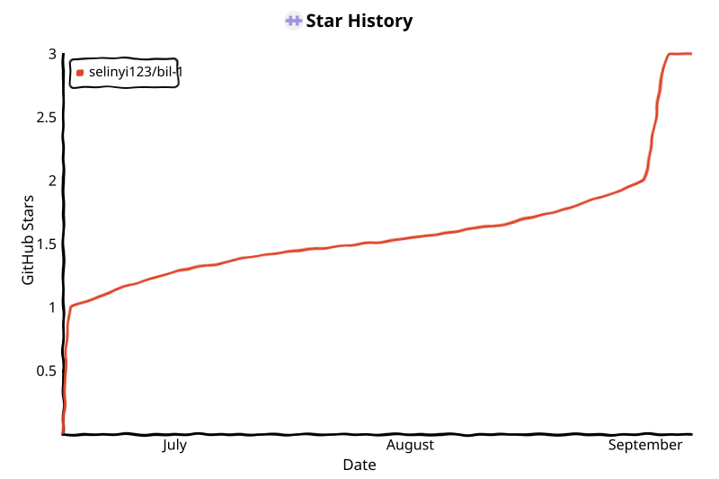

<p align="center">
  
</p>

<h1 align="center">Binggo</h1>

<p align="center">
  本机运行的 B 站抽奖助手 · Local-first Bilibili lottery helper
</p>

<p align="center">
  <a href="https://github.com/luovicter-collab/bilibinggo/releases/latest"></a>
  <a href="https://github.com/luovicter-collab/bilibinggo/actions/workflows/ci.yml"></a>
  <a href="https://github.com/luovicter-collab/bilibinggo/stargazers"></a>
  <a href="LICENSE"></a>
</p>

<p align="center">
  <a href="https://github.com/luovicter-collab/bilibinggo/releases/latest"><b>下载</b></a>
  &nbsp;·&nbsp;
  <a href="https://luovicter-collab.github.io/bilibinggo/"><b>官网</b></a>
  &nbsp;·&nbsp;
  <a href="docs/console.md"><b>文档</b></a>
  &nbsp;·&nbsp;
  <a href="https://github.com/luovicter-collab/bilibinggo/issues"><b>反馈</b></a>
</p>

Binggo 从 UP 合集与监控用户动态发现进行中的抽奖活动，在本地 Web 控制台登录、更新与参与（含三连批量）。Cookie、活动库与参与记录只保存在你的电脑上；控制台仅监听 `127.0.0.1`，不往云端同步账号数据。

## Features

- **发现** — 多路 UP 合集增量同步，监控名单补全转发动态
- **参与** — 互动 / 转发 / 预约（关注 + 预约）；充电抽奖自动跳过
- **三连** — 按当前筛选一次参与最多 3 条未参加活动
- **调度** — 可选定时更新与参与；与进行中的任务撞车时自动停机
- **跨平台** — Windows 安装包与便携版；macOS Apple Silicon（dmg / zip）

## Quick start

面向**安装包用户**；开发环境端口为 `8787`，见下文 [Development](#development)。

1. 安装并打开 Binggo，浏览器进入控制台（安装包默认 [http://127.0.0.1:8181](http://127.0.0.1:8181)）。
2. 侧栏 **扫码登录** → 在「数据源」对需要的合集点 **更新此源**（日常优先单源，慎用「一键更新」）。
3. 在「活动」筛选未参加 → **参与** 或 **三连参与**。转发抽奖需在概览配置 LLM 并测试通过。

新装后列表为空是正常的，完成登录与更新后会出现活动。逐步说明见 **[控制台使用指南](docs/console.md)**，图文上手见 **[官网 · 上手](https://luovicter-collab.github.io/bilibinggo/#start)**。

| 平台 | Release 文件 |
|------|----------------|
| Windows | `Binggo-Setup-win64.exe`（推荐）、`Binggo-Portable-win64.zip` |
| macOS | `Binggo-macOS-arm64.dmg`、`Binggo-macOS-arm64.zip` |

👉 **[Latest release](https://github.com/luovicter-collab/bilibinggo/releases/latest)**

> Windows 未商业签名、macOS 未公证时，首次运行需按系统提示选择「仍要运行」或右键 **打开**。Intel Mac 请用源码运行。

## Documentation

| | |
|---|---|
| [docs/console.md](docs/console.md) | 控制台各页面说明 |
| [docs/quickstart.md](docs/quickstart.md) | 上手补充 |
| [docs/cli.md](docs/cli.md) | 命令行 |
| [mcp/README.md](mcp/README.md) | 可选 MCP / Agent Skill（不打入安装包） |

设计与数据源等维护者文档见 `docs/` 目录。

## Privacy

凭证保存在本机；数据目录随安装方式不同（安装包、`BINGGO_PORTABLE`、`BINGGO_HOME` 等），可在控制台「概览 → 项目信息」查看当前路径。勿轻信私信「中奖」并要求转账或验证码 — 说明见官网 **[谨防诈骗](https://luovicter-collab.github.io/bilibinggo/#notice)**。

## Development

Python **3.12+**，Node.js **20+**（仅构建前端时需要）。

```bash
git clone https://github.com/luovicter-collab/bilibinggo.git && cd bilibinggo
pip install -r requirements.txt
cd web/frontend && npm ci && npm run build && cd ../..
python scripts/run_dashboard.py
```

测试：`pip install -r requirements-dev.txt && python -m pytest tests/ -q`

## Changelog

版本与更新说明见 **[GitHub Releases](https://github.com/luovicter-collab/bilibinggo/releases)**。

## Star History

<!-- star-history:start -->
<picture>
  <source media="(prefers-color-scheme: dark)" srcset="assets/star-history/star-history-dark.svg">
  
</picture>
<!-- star-history:end -->

## License

[MIT](LICENSE)
